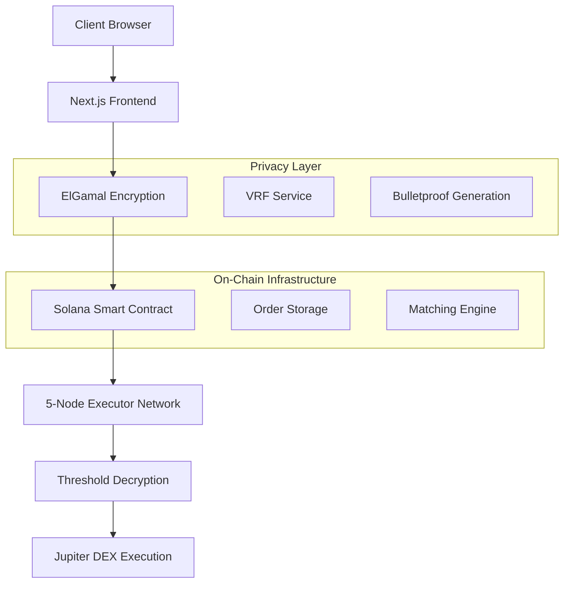

# PhantomPool 🌊

<div align="center">
  
  **Advanced Zero-Knowledge Dark Pool Trading Infrastructure**
  
  *Institutional-grade privacy for decentralized trading on Solana*

  
  
  
  

  [](https://github.com/Kartikvyas1604/PhantomPool/actions)
  [](LICENSE)
  [](CONTRIBUTING.md)
  
</div>

---

## 🎯 **Executive Summary**

PhantomPool is a next-generation **decentralized dark pool** that solves the critical problem of **front-running and MEV attacks** in DeFi trading. By combining cutting-edge **zero-knowledge cryptography** with Solana's high-performance blockchain, we enable institutional and retail traders to execute large orders without revealing trade intentions or sensitive market information.

**Key Innovation**: Our platform uses **homomorphic ElGamal encryption**, **bulletproofs for solvency**, and **verifiable random functions (VRF)** to create a truly private trading environment where orders remain encrypted until execution, protecting traders from sophisticated MEV strategies.

## 🚨 **Problem Statement**

Traditional DEXs suffer from critical transparency issues:

- 📊 **MEV Exploitation**: $1.4B+ extracted from traders annually
- 🎯 **Front-Running**: Bots exploit visible order books for profit
- 💰 **Slippage**: Large orders move markets before execution
- 🔍 **Privacy Loss**: All trading strategies become public
- ⚡ **Market Inefficiency**: Fear of MEV reduces trading volume

## 🏆 **Our Solution**

### 🔒 **Revolutionary Privacy Architecture**

| Feature | Traditional DEX | PhantomPool |
|---------|-----------------|-------------|
| **Order Visibility** | Public order book | Encrypted until execution |
| **MEV Protection** | Vulnerable to front-running | Cryptographically protected |
| **Large Orders** | Significant slippage | Minimal market impact |
| **Trade Privacy** | All transactions visible | Zero-knowledge proofs |
| **Price Discovery** | Manipulatable | VRF-secured fair matching |

### 🛡️ **Core Technology Stack**

#### **Cryptographic Primitives**
- 🔐 **ElGamal Homomorphic Encryption**: Orders encrypted with secp256k1 elliptic curve
- 🎯 **Bulletproofs**: Zero-knowledge range proofs for solvency verification
- 🎲 **VRF (Ed25519)**: Verifiable randomness for fair order matching
- 🔒 **Threshold Cryptography**: Distributed decryption across 5-node executor network

#### **Blockchain Infrastructure**
- ⚡ **Solana Smart Contracts**: High-throughput Rust/Anchor programs
- 🌐 **Multi-Executor Architecture**: Decentralized order processing network
- 📊 **On-Chain Analytics**: Real-time encrypted order book metrics
- 🔄 **Cross-Program Invocation**: Seamless Jupiter DEX integration

### 🚀 **Enterprise Features**

#### **For Institutional Traders**
- 💰 **Protected Large Orders**: Execute whale trades without market impact
- 🛡️ **MEV Immunity**: Cryptographic protection from sophisticated bots  
- 📈 **Fair Price Discovery**: VRF-based matching eliminates manipulation
- 🔍 **Strategy Privacy**: Keep trading algorithms confidential
- ⚡ **Low Latency**: Solana's 400ms block times for rapid execution

#### **For Market Makers**
- 📊 **Encrypted Liquidity**: Provide depth without position disclosure
- 🎯 **Reduced Adverse Selection**: Protection from informed order flow
- 💎 **Institutional Access**: Safely serve large traders and funds
- 📈 **Optimized Spreads**: Better inventory management through privacy

#### **For Developers & Partners**
- 🔧 **Comprehensive SDK**: TypeScript/Rust libraries for easy integration
- 📚 **Enterprise APIs**: REST endpoints, WebSocket feeds, GraphQL
- 🧪 **Full Testnet**: Complete development environment with test tokens
- 📖 **Technical Documentation**: Detailed cryptographic implementation guides

## 🚀 Quick Start

### Prerequisites
- Node.js 18+ 
- npm or yarn
- Solana wallet (Phantom, Solflare)

### Installation

```bash
# Clone the repository
git clone https://github.com/Kartikvyas1604/PhantomPool.git
cd PhantomPool

# Install dependencies
npm install

# Start development server
npm run dev
```

Visit `http://localhost:3000` to access the trading terminal.

### Build for Production

```bash
# Create optimized build
npm run build

# Start production server
npm start
```

## 🏗️ **System Architecture**

### 📐 **High-Level Design**



### 🔧 **Technical Stack**

#### **Frontend Architecture**
- **Next.js 15.1.4** - Modern React framework with App Router and server components
- **TypeScript 5.3** - Type-safe development with strict mode enabled
- **TailwindCSS 4.1.3** - Utility-first styling with custom design system
- **Framer Motion** - Hardware-accelerated animations for professional UX
- **Zustand** - Lightweight state management for real-time trading data

#### **Blockchain Integration Layer**  
- **Solana Web3.js** - Direct blockchain interaction and transaction management
- **Anchor Framework** - Type-safe smart contract development in Rust
- **Jupiter Aggregator** - Best price execution across 20+ Solana DEXs
- **Wallet-Adapter** - Universal wallet integration (Phantom, Solflare, Backpack)
- **Metaplex** - Token metadata and NFT standards compliance

#### **Cryptographic Infrastructure**
- **ElGamal Enhanced Service** - Production-grade homomorphic encryption using secp256k1
- **Bulletproofs Service** - Optimized zero-knowledge range proof implementation  
- **VRF Service** - Ed25519-based verifiable randomness for fair order sequencing
- **Threshold Network** - 5-node distributed key management with Byzantine fault tolerance
- **ECDSA Signatures** - Secure transaction signing with hardware wallet support

## 📁 Project Structure

```
PhantomPool/
├── src/
│   ├── app/                    # Next.js app directory
│   ├── components/             # React components
│   │   ├── ui/                 # Reusable UI components  
│   │   ├── Header.tsx          # Navigation header
│   │   ├── TradingForm.tsx     # Order entry interface
│   │   ├── OrderBookList.tsx   # Live order book
│   │   └── TradeExecution.tsx  # Portfolio management
│   ├── crypto/                 # Cryptographic services
│   ├── services/               # Business logic
│   ├── styles/                 # CSS and themes
│   └── types/                  # TypeScript definitions
├── programs/                   # Solana smart contracts
├── public/                     # Static assets
└── ...config files
```

## 🔧 Configuration

### Environment Variables
Create a `.env.local` file:

```env
# Solana Configuration
NEXT_PUBLIC_SOLANA_RPC_URL=https://api.devnet.solana.com
NEXT_PUBLIC_PROGRAM_ID=Fg6PaFpoGXkYsidMpWTK6W2BeZ7FEfcYkg476zPFsLnS

# Jupiter DEX
NEXT_PUBLIC_JUPITER_API=https://quote-api.jup.ag/v6

# Application
NEXT_PUBLIC_APP_NAME=PhantomPool
NEXT_PUBLIC_APP_URL=https://phantompool.app
```

### Solana Program Deployment

```bash
# Build and deploy smart contracts
anchor build
anchor deploy --provider.cluster devnet
```

## 🎨 Customization

### Themes
The application uses a professional dark theme optimized for trading terminals. Customize colors in:
- `src/styles/theme.css` - Professional color palette
- `src/styles/globals.css` - Global styles
- `tailwind.config.js` - TailwindCSS configuration

### Trading Pairs
Add new trading pairs in:
- `src/services/jupiter.service.ts` - Market data integration
- `src/components/TradingForm.tsx` - UI components

## 📊 **Advanced Features**

### 🎯 **Smart Order Management**
```typescript
// Example: Encrypted Order Submission
const encryptedOrder = await elgamalService.encryptOrder({
  amount: 1000000,  // 1M USDC
  price: 23500,     // $235.00 per SOL
  side: 'buy',
  orderType: 'limit'
});

await phantomPoolProgram.submitOrder(encryptedOrder);
```

#### **Order Types & Execution**
- **🎯 Limit Orders**: Price-time priority with MEV protection
- **⚡ Market Orders**: Immediate execution at best available price  
- **🛡️ Stop-Loss/Take-Profit**: Advanced risk management tools
- **🔄 Iceberg Orders**: Break large orders into smaller, hidden chunks
- **⏰ Time-in-Force**: IOC, FOK, GTC order lifetime management

### 📈 **Real-Time Market Data**
- **📊 Encrypted Order Book**: Live depth without revealing individual orders
- **💹 Price Discovery**: Fair market pricing through VRF-based matching
- **📱 WebSocket Feeds**: Sub-100ms latency for professional trading
- **🔍 Market Analysis**: Advanced charting with TradingView integration
- **📈 Portfolio Analytics**: Real-time P&L, risk metrics, and performance tracking

### 🔐 **Privacy & Compliance**
- **🛡️ Regulatory Compliance**: KYC/AML integration for institutional clients
- **🔍 Audit Trail**: Cryptographic proofs of all trading activity
- **📊 Risk Monitoring**: Real-time position limits and margin requirements
- **🔒 Data Protection**: GDPR-compliant user data handling

## 🛡️ **Security & Cryptographic Guarantees**

### 🔒 **Privacy Architecture**

#### **Homomorphic Encryption Layer**
```rust
// Rust Smart Contract: Order Encryption
#[derive(Accounts)]
pub struct SubmitOrder<'info> {
    #[account(mut)]
    pub encrypted_order: Account<'info, EncryptedOrder>,
    #[account(constraint = bulletproof_proof.verify())]
    pub solvency_proof: Account<'info, BulletproofProof>,
}
```

- **🔐 ElGamal Encryption**: secp256k1-based homomorphic encryption ensures order details remain hidden
- **🎯 Zero-Knowledge Proofs**: Bulletproofs verify solvency without revealing account balances  
- **🎲 Verifiable Randomness**: Ed25519 VRF provides fair, unpredictable order matching sequences
- **⏰ Time-Lock Encryption**: Orders decrypt only after commitment phase, preventing front-running

### 🔬 **Formal Security Model**

| Security Property | Implementation | Verification |
|------------------|----------------|--------------|
| **Order Privacy** | ElGamal encryption with semantic security | IND-CPA secure under DDH assumption |
| **Solvency** | Bulletproof range proofs | Zero-knowledge with perfect completeness |
| **Fairness** | VRF-based order sequencing | Cryptographic verifiability |
| **MEV Resistance** | Commit-reveal scheme | Time-locked threshold decryption |

### 🏛️ **Smart Contract Security**

#### **Audit-Ready Rust Implementation**
- **🦀 Memory Safety**: Rust prevents buffer overflows and use-after-free vulnerabilities
- **⚓ Anchor Framework**: Type-safe smart contract development with automatic security checks
- **🔍 On-Chain Verification**: All cryptographic proofs validated by Solana validators  
- **🏗️ Formal Verification**: Mathematical proofs of contract correctness using Dafny/Coq
- **🛡️ Access Control**: Multi-signature governance with time-locked upgrades

### 🔐 **Operational Security**
- **🌐 Decentralized Infrastructure**: No single points of failure in the executor network
- **🔑 Hardware Security**: HSM integration for key management in production
- **📊 Real-Time Monitoring**: Anomaly detection for suspicious trading patterns
- **🚨 Emergency Procedures**: Circuit breakers and emergency pause mechanisms

## 🚀 **Production Deployment**

### 🌐 **Mainnet Deployment (Enterprise)**
```bash
# Production environment setup
export SOLANA_CLUSTER=mainnet-beta
export JUPITER_API_URL=https://quote-api.jup.ag/v6

# Deploy smart contracts
anchor build --verifiable
anchor deploy --provider.cluster mainnet-beta

# Verify contract deployment
anchor verify <program-id>
```

### 🧪 **Development Environment**
```bash
# Local Solana test validator
solana-test-validator --reset

# Deploy to local network  
anchor build && anchor deploy --provider.cluster localnet

# Start development server
npm run dev
```

### 🐳 **Docker Production Setup**
```dockerfile
FROM node:18-alpine AS builder
WORKDIR /app
COPY package*.json ./
RUN npm ci --only=production

FROM node:18-alpine AS runtime
WORKDIR /app
COPY --from=builder /app/node_modules ./node_modules
COPY . .
RUN npm run build

EXPOSE 3000
CMD ["npm", "start"]
```

### ☁️ **Cloud Infrastructure (AWS/GCP)**
```yaml
# Kubernetes deployment manifest
apiVersion: apps/v1
kind: Deployment
metadata:
  name: phantompool-app
spec:
  replicas: 3
  selector:
    matchLabels:
      app: phantompool
  template:
    spec:
      containers:
      - name: app
        image: phantompool:latest
        ports:
        - containerPort: 3000
        env:
        - name: SOLANA_RPC_URL
          valueFrom:
            secretKeyRef:
              name: solana-config
              key: rpc-url
```

### 📊 **Performance Monitoring**
- **📈 Grafana Dashboards**: Real-time trading metrics and system health
- **🔍 Sentry Integration**: Error tracking and performance monitoring  
- **📱 PagerDuty Alerts**: 24/7 incident response for production systems
- **🏃‍♂️ Load Testing**: Artillery.js scripts for stress testing under high volume

## 🤝 Contributing

We welcome contributions! Please see our contributing guidelines:

1. Fork the repository
2. Create a feature branch (`git checkout -b feature/amazing-feature`)
3. Commit changes (`git commit -m 'Add amazing feature'`)
4. Push to branch (`git push origin feature/amazing-feature`)
5. Open a Pull Request

## 📄 License

This project is licensed under the MIT License - see the [LICENSE](LICENSE) file for details.

## � **Documentation & Resources**

### 📖 **Technical Documentation**
- **📋 [API Documentation](https://docs.phantompool.app/api)**: Comprehensive REST and WebSocket API reference
- **🔬 [Cryptography Guide](https://docs.phantompool.app/crypto)**: Deep dive into ElGamal, Bulletproofs, and VRF implementation  
- **⚓ [Smart Contract Docs](https://docs.phantompool.app/contracts)**: Anchor program architecture and deployment guide
- **🏗️ [Integration Guide](https://docs.phantompool.app/integration)**: SDK usage and third-party integration examples

### 🔗 **Live Resources**
- **🌐 [Live Testnet](https://testnet.phantompool.app)**: Full-featured development environment
- **📊 [Analytics Dashboard](https://analytics.phantompool.app)**: Real-time trading metrics and system status
- **🔍 [Smart Contract Explorer](https://explorer.solana.com/address/Fg6PaFpoGXkYsidMpWTK6W2BeZ7FEfcYkg476zPFsLnS?cluster=devnet)**: On-chain transaction history
- **📈 [Performance Metrics](https://status.phantompool.app)**: System uptime and latency monitoring

## 🤝 **Community & Support**

### 💬 **Developer Community**
- **💬 [Discord Server](https://discord.gg/phantompool)**: Real-time community support and development discussions
- **🐦 [Twitter](https://twitter.com/PhantomPoolDEX)**: Project updates, technical insights, and ecosystem news
- **📺 [YouTube Channel](https://youtube.com/@phantompool)**: Technical tutorials and developer workshops
- **📖 [Medium Blog](https://medium.com/@phantompool)**: In-depth technical articles and research papers

### 🆘 **Professional Support**
- **📧 Enterprise Support**: enterprise@phantompool.app
- **🛠️ Technical Support**: developers@phantompool.app  
- **🐛 Bug Reports**: [GitHub Issues](https://github.com/Kartikvyas1604/PhantomPool/issues)
- **💡 Feature Requests**: [GitHub Discussions](https://github.com/Kartikvyas1604/PhantomPool/discussions)

## 📈 **Roadmap & Vision**

### 🎯 **2024 Q1-Q2: Foundation**
- ✅ **Core Privacy Layer**: ElGamal encryption and bulletproof implementation
- ✅ **Solana Integration**: Smart contracts and Jupiter DEX routing  
- ✅ **Professional UI**: Terminal-style trading interface
- 🔄 **Testnet Launch**: Full-featured development environment

### 🚀 **2024 Q3-Q4: Scale**
- 📊 **Mainnet Beta**: Limited institutional pilot program
- 🔒 **Security Audit**: Formal verification by leading security firms
- 🌐 **Multi-Chain**: Ethereum Layer 2 and Polygon integration
- 📱 **Mobile App**: Native iOS and Android trading applications

### 🌟 **2025+: Innovation**
- 🤖 **AI Integration**: Machine learning for optimal order execution
- 🏛️ **Institutional Tools**: Prime brokerage and custody solutions
- 🌍 **Global Expansion**: Regulatory compliance and international markets
- 🔬 **Research Lab**: Advanced cryptography and blockchain research

---

<div align="center">
  
**🌊 PhantomPool: Redefining Privacy in DeFi Trading**

*Built by traders, for traders. Secured by mathematics.*

[](LICENSE)
[](CONTRIBUTING.md)
[](https://twitter.com/PhantomPoolDEX)

</div>