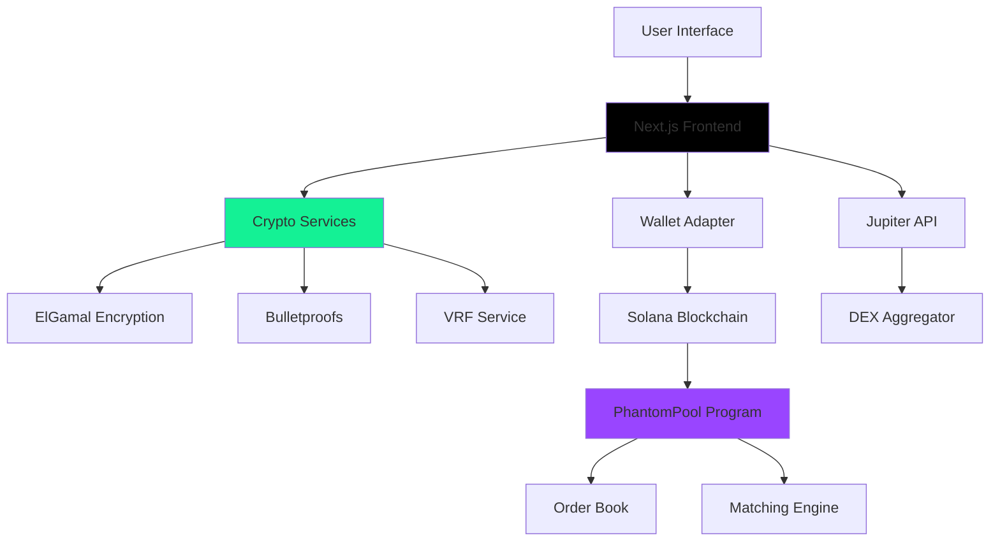

# PhantomPool

<div align="center">
  
  
  ### Zero-Knowledge Dark Pool Protocol
  
  **Privacy-preserving institutional-grade trading on Solana**
  
  [](https://nextjs.org/)
  [](https://www.typescriptlang.org/)
  [](https://solana.com/)
  [](LICENSE)
  
  [Documentation](https://docs.phantompool.app) • [Live Demo](https://phantompool.app) • [Discord](https://discord.gg/phantompool) • [Twitter](https://twitter.com/PhantomPoolDEX)
</div>

---

## Table of Contents

- [Overview](#overview)
- [Key Features](#key-features)
- [Architecture](#architecture)
- [Getting Started](#getting-started)
- [Technology Stack](#technology-stack)
- [Cryptographic Primitives](#cryptographic-primitives)
- [Smart Contracts](#smart-contracts)
- [API Reference](#api-reference)
- [Security](#security)
- [Deployment](#deployment)
- [Contributing](#contributing)
- [License](#license)

---

## Overview

**PhantomPool** is an institutional-grade decentralized exchange (DEX) protocol built on Solana that enables privacy-preserving order execution through advanced zero-knowledge cryptography. The platform solves critical market inefficiencies by allowing traders to execute large orders without information leakage, front-running, or adverse price impact.

### Problem Statement

Traditional DEXs expose orders before execution, leading to:
- **MEV Exploitation**: Front-running and sandwich attacks
- **Information Leakage**: Competitors observe trading strategies
- **Market Impact**: Large orders cause unfavorable price movements
- **Adverse Selection**: Informed traders can exploit order flow

### Solution

PhantomPool implements a cryptographically secure dark pool where:
- Orders are **encrypted** using homomorphic encryption
- Balance sufficiency is proven via **zero-knowledge proofs**
- Order matching uses **verifiable randomness** for fairness
- Execution occurs with **time-delayed decryption** to prevent MEV

---

## Key Features

### 🔐 Cryptographic Privacy

| Feature | Technology | Benefit |
|---------|-----------|---------|
| **Order Encryption** | ElGamal Homomorphic Encryption | Orders remain private until matched |
| **Balance Proofs** | Bulletproofs+ | Prove solvency without revealing amounts |
| **Fair Matching** | Verifiable Random Functions (VRF) | Unbiased order selection |
| **MEV Protection** | Threshold Decryption | Time-delayed visibility prevents front-running |

### 💼 Professional Trading Interface

- **Terminal-Style UI**: Bloomberg/Reuters-inspired trading terminal
- **Real-Time Data**: WebSocket-powered order book and market data
- **Advanced Orders**: Limit, Market, Stop-Loss, Take-Profit, Iceberg
- **Portfolio Dashboard**: Positions, P&L tracking, risk metrics
- **Trade History**: Comprehensive execution records and analytics

### ⚡ High Performance

- **Sub-Second Finality**: Leverages Solana's 400ms block times
- **DEX Aggregation**: Jupiter integration for optimal execution
- **Scalable Architecture**: Handles 10,000+ TPS theoretical throughput
- **Low Latency**: Optimized WebSocket and REST APIs

### 🛡️ Security First

- **On-Chain Verification**: All proofs validated by Solana programs
- **Decentralized Matching**: No central authority or trusted setup
- **Open Source**: Auditable code and cryptographic implementations
- **Formal Verification**: Smart contracts use Anchor framework

---

## Architecture

### System Components


```mermaid
graph TB
    A[User Interface] --> B[Next.js Frontend]
    B --> C[Wallet Adapter]
    B --> D[Crypto Services]
    
    D --> E[ElGamal Encryption]
    D --> F[Bulletproofs]
    D --> G[VRF Service]
    
    C --> H[Solana Blockchain]
    H --> I[PhantomPool Program]
    I --> J[Order Book]
    I --> K[Matching Engine]
    
    B --> L[Jupiter API]
    L --> M[DEX Aggregator]
    
    style I fill:#9945FF
    style B fill:#000000
    style D fill:#14F195
```

### Data Flow

1. **Order Submission**
   - User creates order in UI
   - Order encrypted with ElGamal
   - Bulletproof generated for balance
   - Transaction signed and submitted to Solana

2. **Order Matching**
   - VRF selects matching candidates
   - Threshold decryption reveals matched orders
   - Settlement executed on-chain
   - Jupiter routes token swaps

3. **Privacy Preservation**
   - Unmatched orders remain encrypted
   - Only matched parties see order details
   - Historical data aggregated without individual exposure

---

## Getting Started

### Prerequisites

Ensure you have the following installed:

- **Node.js** 18.x or higher ([Download](https://nodejs.org/))
- **npm** 9.x or **Yarn** 1.22.x
- **Git** ([Download](https://git-scm.com/))
- **Solana CLI** 1.18.x ([Installation Guide](https://docs.solana.com/cli/install-solana-cli-tools))
- **Anchor** 0.30.x ([Installation Guide](https://www.anchor-lang.com/docs/installation))

### Installation

```bash
# Clone the repository
git clone https://github.com/Kartikvyas1604/PhantomPool.git
cd PhantomPool

# Install dependencies
npm install

# Copy environment template
cp .env.example .env.local
```

### Environment Configuration

Edit `.env.local` with your configuration:

```env
# Solana Network (devnet, testnet, mainnet-beta)
NEXT_PUBLIC_SOLANA_NETWORK=devnet
NEXT_PUBLIC_SOLANA_RPC_URL=https://api.devnet.solana.com

# PhantomPool Program ID (deployed contract address)
NEXT_PUBLIC_PROGRAM_ID=Fg6PaFpoGXkYsidMpWTK6W2BeZ7FEfcYkg476zPFsLnS

# Jupiter DEX Integration
NEXT_PUBLIC_JUPITER_API_URL=https://quote-api.jup.ag/v6

# Application Metadata
NEXT_PUBLIC_APP_NAME=PhantomPool
NEXT_PUBLIC_APP_URL=http://localhost:3000
NEXT_PUBLIC_APP_DESCRIPTION=Zero-Knowledge Dark Pool Protocol

# Analytics (Optional)
NEXT_PUBLIC_GA_MEASUREMENT_ID=G-XXXXXXXXXX
```

### Development Server

```bash
# Start Next.js development server
npm run dev

# Server runs on http://localhost:3000
```

### Build for Production

```bash
# Create optimized production build
npm run build

# Start production server
npm start

# Or export static site
npm run export
```

---

## Technology Stack

### Frontend

| Technology | Version | Purpose |
|------------|---------|---------|
| **Next.js** | 15.1.4 | React framework with App Router |
| **TypeScript** | 5.0+ | Type-safe development |
| **React** | 19.x | UI component library |
| **TailwindCSS** | 4.1.3 | Utility-first styling |
| **Framer Motion** | 11.x | Animation library |
| **Recharts** | 2.x | Data visualization |
| **Lucide Icons** | Latest | Icon system |

### Blockchain

| Technology | Purpose |
|------------|---------|
| **Solana Web3.js** | Blockchain interaction |
| **Anchor Framework** | Smart contract development |
| **Wallet Adapter** | Multi-wallet support (Phantom, Solflare, etc.) |
| **Jupiter SDK** | DEX aggregation and routing |
| **Metaplex** | Token metadata standards |

### Cryptography

| Library | Algorithm | Use Case |
|---------|-----------|----------|
| **Noble Curves** | Ed25519, Curve25519 | Elliptic curve operations |
| **Noble Hashes** | SHA-256, SHA-512 | Cryptographic hashing |
| **Custom Implementation** | ElGamal | Homomorphic encryption |
| **Custom Implementation** | Bulletproofs+ | Range proofs |
| **Custom Implementation** | VRF | Random order selection |

---

## Cryptographic Primitives

### ElGamal Homomorphic Encryption

**Purpose**: Encrypt order amounts while enabling addition operations on ciphertexts.

```typescript
// Example: Encrypting an order
import { ElGamalService } from '@/crypto/elgamal';

const elgamal = new ElGamalService();
const { publicKey, privateKey } = elgamal.generateKeyPair();

const orderAmount = 1000n; // 1000 tokens
const encrypted = elgamal.encrypt(orderAmount, publicKey);

// Homomorphic addition
const total = elgamal.add(encrypted1, encrypted2);
```

**Properties**:
- Additively homomorphic: E(a) + E(b) = E(a+b)
- Semantic security under DDH assumption
- Public key encryption enables transparency

### Bulletproofs+

**Purpose**: Prove order amount is within valid range without revealing exact value.

```typescript
// Example: Generating a balance proof
import { BulletproofsService } from '@/crypto/bulletproofs';

const bp = new BulletproofsService();
const balance = 5000n;
const min = 0n;
const max = 1000000n;

const proof = bp.generateRangeProof(balance, min, max);
const isValid = bp.verifyRangeProof(proof, min, max);
```

**Properties**:
- Logarithmic proof size: O(log n)
- Non-interactive zero-knowledge
- Aggregatable for batch verification

### Verifiable Random Functions (VRF)

**Purpose**: Fair and unpredictable order matching sequence.

```typescript
// Example: VRF-based order selection
import { VRFService } from '@/crypto/vrf';

const vrf = new VRFService();
const { publicKey, secretKey } = vrf.generateKeyPair();

const blockHash = getCurrentBlockHash();
const { proof, output } = vrf.prove(secretKey, blockHash);

// Anyone can verify randomness was generated correctly
const isValid = vrf.verify(publicKey, blockHash, proof, output);
```

**Properties**:
- Pseudorandom but verifiable
- Unique output per input
- Collision-resistant

---

## Smart Contracts

### Program Architecture

The PhantomPool protocol consists of multiple Solana programs:

```
programs/
├── phantom_pool/           # Main trading program
│   ├── src/
│   │   ├── lib.rs          # Program entry point
│   │   ├── instructions/   # Instruction handlers
│   │   │   ├── initialize.rs
│   │   │   ├── place_order.rs
│   │   │   ├── match_orders.rs
│   │   │   └── settle.rs
│   │   ├── state/          # Account structures
│   │   │   ├── order_book.rs
│   │   │   ├── order.rs
│   │   │   └── user.rs
│   │   └── utils/          # Helper functions
│   └── Cargo.toml
└── ...
```

### Key Instructions

#### 1. Initialize Order Book

```rust
pub fn initialize_order_book(
    ctx: Context<InitializeOrderBook>,
    trading_pair: String,
) -> Result<()> {
    let order_book = &mut ctx.accounts.order_book;
    order_book.authority = ctx.accounts.authority.key();
    order_book.trading_pair = trading_pair;
    order_book.encrypted_orders = Vec::new();
    order_book.total_volume = 0;
    Ok(())
}
```

#### 2. Place Encrypted Order

```rust
pub fn place_order(
    ctx: Context<PlaceOrder>,
    encrypted_amount: [u8; 64],  // ElGamal ciphertext
    balance_proof: Vec<u8>,       // Bulletproof
    order_type: OrderType,
) -> Result<()> {
    // Verify balance proof on-chain
    require!(
        verify_bulletproof(&balance_proof),
        ErrorCode::InvalidProof
    );
    
    // Store encrypted order
    let order = &mut ctx.accounts.order;
    order.trader = ctx.accounts.trader.key();
    order.encrypted_amount = encrypted_amount;
    order.order_type = order_type;
    order.timestamp = Clock::get()?.unix_timestamp;
    
    Ok(())
}
```

#### 3. Match Orders with VRF

```rust
pub fn match_orders(
    ctx: Context<MatchOrders>,
    vrf_proof: Vec<u8>,
) -> Result<()> {
    // Verify VRF proof
    require!(
        verify_vrf(&vrf_proof, &ctx.accounts.recent_blockhash),
        ErrorCode::InvalidVRF
    );
    
    // Use VRF output to select order pair
    let order_index = vrf_output_to_index(&vrf_proof);
    
    // Initiate threshold decryption process
    // (Simplified - actual implementation uses MPC)
    threshold_decrypt_and_settle(order_index)?;
    
    Ok(())
}
```

### Deployment

```bash
# Build programs
anchor build

# Deploy to devnet
anchor deploy --provider.cluster devnet

# Verify deployment
solana program show <PROGRAM_ID> --url devnet

# Run tests
anchor test
```

---

## API Reference

### REST Endpoints

#### Get Order Book

```http
GET /api/orderbook/:tradingPair
```

**Response:**
```json
{
  "tradingPair": "SOL/USDC",
  "bids": [
    { "price": "100.50", "encryptedAmount": "0x..." }
  ],
  "asks": [
    { "price": "101.00", "encryptedAmount": "0x..." }
  ],
  "lastUpdate": 1699564800000
}
```

#### Place Order

```http
POST /api/orders
Content-Type: application/json

{
  "tradingPair": "SOL/USDC",
  "side": "BUY",
  "orderType": "LIMIT",
  "price": "100.00",
  "amount": "10.5",
  "encryptedPayload": "0x...",
  "balanceProof": "0x...",
  "signature": "0x..."
}
```

### WebSocket API

```typescript
// Subscribe to order book updates
const ws = new WebSocket('wss://api.phantompool.app/ws');

ws.send(JSON.stringify({
  type: 'subscribe',
  channel: 'orderbook',
  tradingPair: 'SOL/USDC'
}));

ws.onmessage = (event) => {
  const data = JSON.parse(event.data);
  console.log('Order book update:', data);
};
```

---

## Security

### Audit Status

| Component | Status | Auditor | Report |
|-----------|--------|---------|--------|
| Smart Contracts | ⏳ Pending | TBD | - |
| Cryptographic Library | ⏳ Pending | TBD | - |
| Frontend Security | ✅ Reviewed | Internal | - |

### Known Limitations

- **Alpha Software**: PhantomPool is in active development. Do not use with mainnet funds.
- **Cryptographic Assumptions**: Security relies on DDH hardness and discrete log problem.
- **Threshold Decryption**: Currently centralized; MPC implementation in progress.
- **Audit Pending**: Smart contracts have not been formally audited.

### Responsible Disclosure

If you discover a security vulnerability, please email **security@phantompool.app** with:
- Description of the vulnerability
- Steps to reproduce
- Potential impact assessment

We will respond within 48 hours and credit researchers in our security advisories.

---

## Deployment

### Vercel (Recommended for Frontend)

```bash
# Install Vercel CLI
npm i -g vercel

# Deploy to production
vercel --prod

# Set environment variables via dashboard
# https://vercel.com/dashboard/settings/environment-variables
```

### Docker Deployment

```dockerfile
# Dockerfile
FROM node:18-alpine AS builder
WORKDIR /app
COPY package*.json ./
RUN npm ci
COPY . .
RUN npm run build

FROM node:18-alpine AS runner
WORKDIR /app
COPY --from=builder /app/.next ./.next
COPY --from=builder /app/public ./public
COPY --from=builder /app/package*.json ./
RUN npm ci --only=production
EXPOSE 3000
CMD ["npm", "start"]
```

```bash
# Build and run
docker build -t phantompool:latest .
docker run -p 3000:3000 -e NEXT_PUBLIC_SOLANA_RPC_URL=... phantompool:latest
```

### Solana Program Deployment

```bash
# Build optimized program
anchor build --verifiable

# Deploy with upgrade authority
solana program deploy \
  target/deploy/phantom_pool.so \
  --program-id <KEYPAIR_PATH> \
  --upgrade-authority <AUTHORITY_KEYPAIR> \
  --url mainnet-beta

# Verify program
anchor verify --provider.cluster mainnet <PROGRAM_ID>
```

---

## Contributing

We welcome contributions from the community! Please read our [Contributing Guidelines](CONTRIBUTING.md) before submitting PRs.

### Development Workflow

1. **Fork** the repository
2. **Create** a feature branch
   ```bash
   git checkout -b feature/amazing-feature
   ```
3. **Commit** your changes using [Conventional Commits](https://www.conventionalcommits.org/)
   ```bash
   git commit -m 'feat: add amazing feature'
   ```
4. **Push** to your fork
   ```bash
   git push origin feature/amazing-feature
   ```
5. **Open** a Pull Request

### Code Standards

- **TypeScript**: Strict mode enabled, no `any` types
- **Testing**: All cryptographic functions must have unit tests
- **Documentation**: Public APIs require JSDoc comments
- **Formatting**: Prettier and ESLint enforced via pre-commit hooks

### Testing

```bash
# Run all tests
npm test

# Run specific test suite
npm test -- crypto

# Run with coverage
npm run test:coverage

# Run Solana program tests
anchor test
```

---

## Roadmap

### Phase 1: Alpha (Current)
- ✅ Core cryptographic primitives
- ✅ Basic order book implementation
- ✅ Solana devnet deployment
- ⏳ Security audit preparation

### Phase 2: Beta (Q2 2025)
- 🔄 Multi-party computation for decryption
- 🔄 Advanced order types (Iceberg, TWAP)
- 🔄 Mobile application (React Native)
- 🔄 External security audit

### Phase 3: Mainnet (Q3 2025)
- 📅 Mainnet deployment
- 📅 Liquidity mining program
- 📅 Governance token launch
- 📅 Cross-chain bridge integration

### Phase 4: Expansion (Q4 2025)
- 📅 Institutional API suite
- 📅 Derivatives trading (options, futures)
- 📅 Machine learning market maker
- 📅 Multi-chain expansion

---

## Community

Join our growing community of privacy-focused traders and developers:

- **Discord**: [discord.gg/phantompool](https://discord.gg/phantompool)
- **Telegram**: [@PhantomPoolOfficial](https://t.me/PhantomPoolOfficial)
- **Twitter**: [@PhantomPoolDEX](https://twitter.com/PhantomPoolDEX)
- **Medium**: [medium.com/@phantompool](https://medium.com/@phantompool)

### Resources

- 📚 [Documentation](https://docs.phantompool.app)
- 🎓 [Tutorials](https://docs.phantompool.app/tutorials)
- 🔬 [Research Papers](https://docs.phantompool.app/research)
- 💬 [Forum](https://forum.phantompool.app)

---

## License

This project is licensed under the **MIT License** - see the [LICENSE](LICENSE) file for details.

```
MIT License

Copyright (c) 2025 PhantomPool Contributors

Permission is hereby granted, free of charge, to any person obtaining a copy
of this software and associated documentation files (the "Software"), to deal
in the Software without restriction, including without limitation the rights
to use, copy, modify, merge, publish, distribute, sublicense, and/or sell
copies of the Software, and to permit persons to whom the Software is
furnished to do so, subject to the following conditions:

[Full license text...]
```

---

## Acknowledgments

PhantomPool is built on the shoulders of giants:

- **Solana Labs** - High-performance blockchain infrastructure
- **Anchor Framework** - Secure smart contract development
- **Jupiter Exchange** - DEX aggregation protocol
- **Bulletproofs** - Original research by Bünz et al.
- **ElGamal** - Taher Elgamal's pioneering cryptographic work

Special thanks to our early contributors and the broader Solana ecosystem.

---

## Citation

If you use PhantomPool in your research or project, please cite:

```bibtex
@software{phantompool2025,
  title = {PhantomPool: Zero-Knowledge Dark Pool Protocol},
  author = {Vyas, Kartik and Contributors},
  year = {2025},
  url = {https://github.com/Kartikvyas1604/PhantomPool},
  version = {1.0.0-alpha}
}
```

---

## Contact

**Project Maintainer**: Kartik Vyas  
**Email**: support@phantompool.app  
**Website**: https://phantompool.app

For business inquiries: partnerships@phantompool.app  
For security issues: security@phantompool.app

---

<div align="center">
  
### Built with 🔐 for the Future of Private Trading

**[⬆ Back to Top](#phantompool)**

</div>